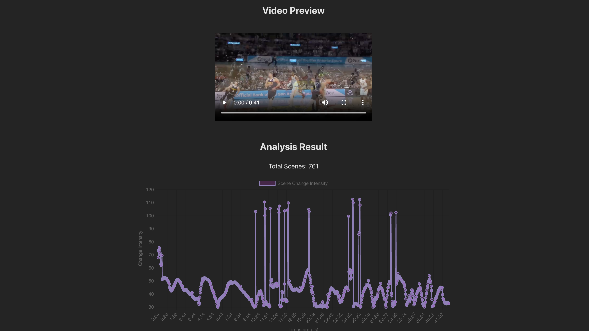
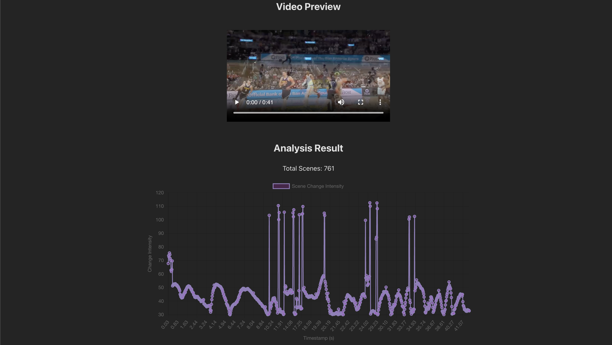

# TV Ad Detector 📺✨


## 🚀 About the Project

TV Ad Detector is a powerful tool that uses computer vision techniques to identify advertisement frames in video content. With a backend built using **Flask**, **Gunicorn**, and **OpenCV**, and a modern **React**-based frontend, this project provides an efficient solution to distinguish ads from non-ad video segments using **Mean Squared Error (MSE)** as the detection mechanism.

## 🛠️ Features

- **Automated Ad Detection**: Identify ad frames in video content with high precision using MSE.  
- **Real-Time Feedback**: Visualize the detected ad frames on the frontend.  
- **Cross-Origin Support**: Seamless communication between frontend and backend with **Flask-CORS**.  
- **Production-Ready Backend**: Scalable and efficient backend powered by **Gunicorn**.  
- **User-Friendly Interface**: Built with React for a modern and interactive user experience.

## 📷 Screenshots

Here are some snapshots of the TV Ad Detector in action:

### Home Page


### Ad Detection Results



## 🧑‍💻 Technologies Used

### Backend:
- **Flask**: Lightweight Python web framework.
- **Flask-CORS**: Handle cross-origin resource sharing between frontend and backend.
- **OpenCV-Python**: Computer vision library for processing video frames.
- **Gunicorn**: WSGI HTTP server for production-ready backend.

### Frontend:
- **React**: JavaScript library for building user interfaces.

## 📖 How It Works

1. **Video Input**: The user uploads a video file through the React frontend.  
2. **Frame Processing**: The backend processes the video frame-by-frame using OpenCV.  
3. **Ad Detection**: Mean Squared Error (MSE) is used to identify frames that likely belong to ads.  
4. **Results**: The detected ad frames are sent back to the frontend and displayed.

## ⚡ Getting Started

### Prerequisites
Ensure you have the following installed:
- Python 3.8+
- Node.js 14+
- Gunicorn

### Installation

1. **Clone the Repository**:
   ```bash
   git clone https://github.com/your-username/tv-ad-detector.git
   cd tv-ad-detector
   ```

2. **Set up the Backend**:
   ```bash
   cd backend
   pip install -r requirements.txt
   gunicorn --bind 0.0.0.0:5000 wsgi:app
   ```

3. **Set up the Frontend**:
   ```bash
   cd ../frontend
   npm install
   npm start
   ```

4. **Access the Application**:  
   Open your browser and navigate to `http://localhost:3000`.

### 📊 Test Data and Results

The **TV Ad Detector** was tested using a video of an **NBA game** with advertisements stitched between game segments. The video was processed frame by frame using **Mean Squared Error (MSE)** to compare consecutive frames and detect significant differences that typically indicate ad transitions.

#### Visualization of Results

The detection results are plotted as a graph, where **peaks represent frames with ads**. These peaks correspond to the abrupt changes in content when ads are introduced into the video. While the graph provides a clear indication of ad positions, the detection logic is currently in its basic form and requires further tuning for higher accuracy and robustness.

- **Current Limitations**:  
  - The algorithm may miss subtle ad transitions or falsely detect non-ads in certain scenarios.  
  - Optimizing parameters and integrating additional heuristics or machine learning models can improve performance.

- **Future Work**:  
  - Enhance the MSE thresholding to adapt dynamically based on video characteristics.  
  - Incorporate temporal analysis to improve accuracy in detecting continuous ad segments.

#### Sample Output

Below is a graph from the NBA game test data, where peaks signify the frames identified as advertisements:  


Despite the need for further refinement, the project demonstrates the feasibility of detecting advertisements in video content with relatively simple computer vision techniques.

---
